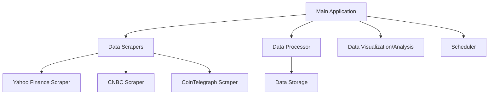
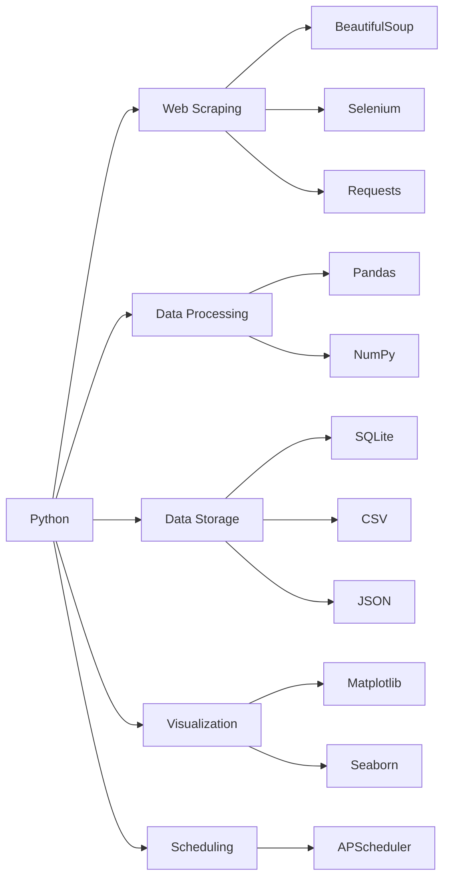

# Web Scraping Trading Information - Project Plan

## 1. Project Overview

We'll create a Python application that scrapes financial data from Yahoo Finance, CNBC, and CoinTelegraph. The application will:

- Extract relevant stock and cryptocurrency information
- Process and clean the data
- Store it in a structured format
- Provide basic visualization and analysis capabilities

## 2. System Architecture



## 3. Components Breakdown

### 3.1 Data Scrapers

#### Yahoo Finance Scraper
- **Data to scrape:**
  - Stock prices (open, high, low, close)
  - Trading volume
  - Market capitalization
  - P/E ratio
  - 52-week high/low
  - Dividend yield
  - Company information

#### CNBC Scraper
- **Data to scrape:**
  - Financial news headlines
  - Market summaries
  - Stock market indices
  - Featured articles
  - Breaking news alerts

#### CoinTelegraph Scraper
- **Data to scrape:**
  - Cryptocurrency prices
  - Trading volume
  - Market capitalization
  - News articles
  - Market sentiment

### 3.2 Data Processor
- Clean and normalize data
- Handle missing values
- Convert data types
- Standardize formats across different sources

### 3.3 Data Storage
- **Options:**
  - CSV files (simple, portable)
  - SQLite database (structured, queryable)
  - JSON files (flexible schema)

### 3.4 Data Visualization/Analysis
- Basic charts and graphs
- Summary statistics
- Trend analysis
- Export capabilities

### 3.5 Scheduler
- Configurable scraping frequency
- Automated data collection
- Error handling and retry logic

## 4. Technical Implementation

### 4.1 Technology Stack



### 4.2 Project Structure

```
tradingapp/
├── scrapers/
│   ├── __init__.py
│   ├── yahoo_finance.py
│   ├── cnbc.py
│   └── cointelegraph.py
├── processors/
│   ├── __init__.py
│   └── data_processor.py
├── storage/
│   ├── __init__.py
│   └── data_storage.py
├── visualization/
│   ├── __init__.py
│   └── data_visualizer.py
├── utils/
│   ├── __init__.py
│   ├── config.py
│   └── logger.py
├── tests/
│   ├── __init__.py
│   ├── test_scrapers.py
│   ├── test_processors.py
│   ├── test_storage.py
│   └── test_visualization.py
├── docs/
│   ├── installation.md
│   ├── usage.md
│   ├── api_reference.md
│   └── development.md
├── scheduler.py
├── main.py
├── requirements.txt
└── README.md
```

## 5. Implementation Plan

### Phase 1: Setup and Basic Scraping
1. Set up project structure
2. Install required dependencies
3. Implement basic scraping functionality for each site
4. Implement data storage in CSV format

### Phase 2: Data Processing and Enhanced Scraping
1. Implement data cleaning and processing
2. Enhance scrapers with error handling
3. Add proxy support for avoiding rate limits
4. Implement SQLite storage option

### Phase 3: Visualization and Scheduling
1. Implement basic data visualization
2. Add scheduling capabilities
3. Implement logging and monitoring
4. Create configuration system

### Phase 4: Testing and Refinement
1. Write unit tests
2. Perform integration testing
3. Optimize performance
4. Document code and usage

## 6. Challenges and Considerations

### 6.1 Technical Challenges
- **Anti-scraping measures:** Websites may implement CAPTCHAs, IP blocking, or dynamic content loading
- **Site structure changes:** Website updates may break scrapers
- **Rate limiting:** Too many requests may result in temporary IP bans
- **JavaScript rendering:** Some content may require browser rendering

### 6.2 Legal and Ethical Considerations
- Respect robots.txt files
- Implement reasonable request rates
- Review terms of service for each website
- Consider using official APIs where available

### 6.3 Performance Considerations
- Implement caching mechanisms
- Use asynchronous requests where appropriate
- Optimize database queries
- Implement incremental scraping

## 7. Documentation Plan

### 7.1 Code Documentation
- **Docstrings:** Comprehensive docstrings for all classes and functions
- **Type hints:** Use Python type hints for better code understanding
- **Comments:** Explain complex logic and algorithms
- **Examples:** Include usage examples in docstrings

### 7.2 Project Documentation
- **README.md:** Project overview, quick start guide, and basic usage
- **Installation Guide:** Detailed installation instructions
- **User Guide:** Comprehensive usage documentation
- **API Reference:** Detailed documentation of all public APIs
- **Development Guide:** Information for contributors
- **Architecture Document:** Detailed system design and component interaction

### 7.3 Documentation Format
- Use Markdown for all documentation
- Include diagrams where appropriate
- Provide code examples for common use cases
- Keep documentation in sync with code changes

## 8. Testing Strategy

### 8.1 Unit Testing
- Test individual components in isolation
- Mock external dependencies
- Achieve high code coverage (target: >80%)
- Test edge cases and error handling

### 8.2 Integration Testing
- Test component interactions
- Verify data flow between modules
- Test with realistic data scenarios

### 8.3 End-to-End Testing
- Test complete workflows
- Verify system behavior as a whole
- Include real-world scenarios

### 8.4 Test Data
- Create mock responses for web requests
- Maintain a dataset of sample responses
- Include both normal and edge cases

### 8.5 Testing Tools
- **pytest:** Main testing framework
- **pytest-cov:** Code coverage reporting
- **VCR.py:** Record and replay HTTP interactions
- **pytest-mock:** Mocking functionality

### 8.6 Continuous Integration
- Run tests automatically on code changes
- Enforce code quality standards
- Generate test and coverage reports

## 9. Future Enhancements
- Web interface for data visualization
- Email/notification alerts for specific events
- Machine learning for price prediction
- Sentiment analysis of news articles
- Integration with trading platforms
- Mobile app for on-the-go monitoring